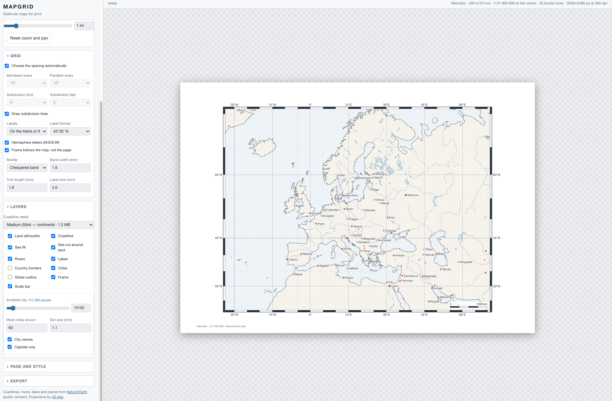
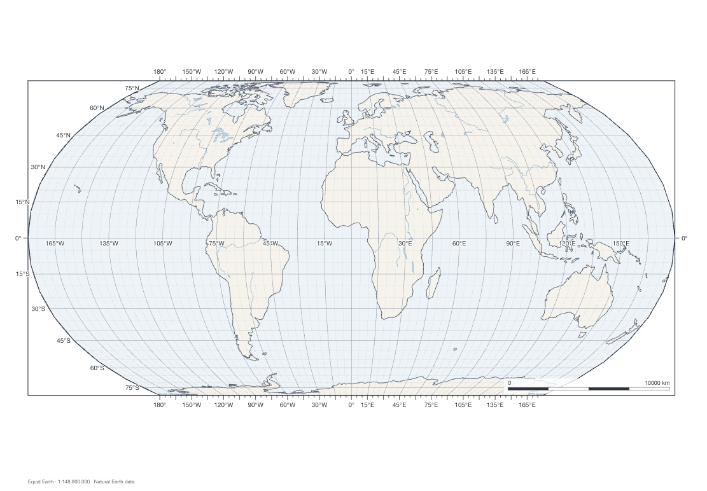
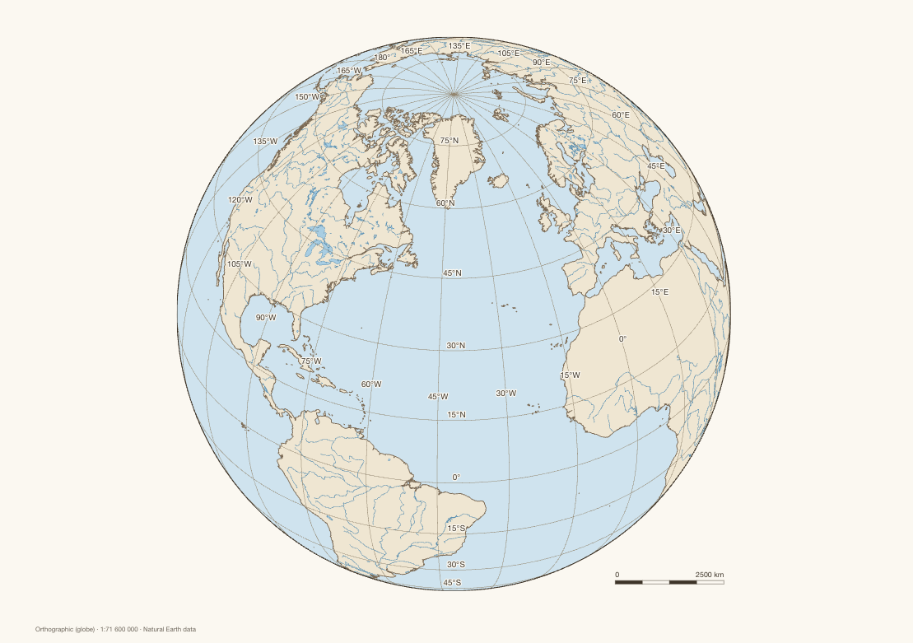
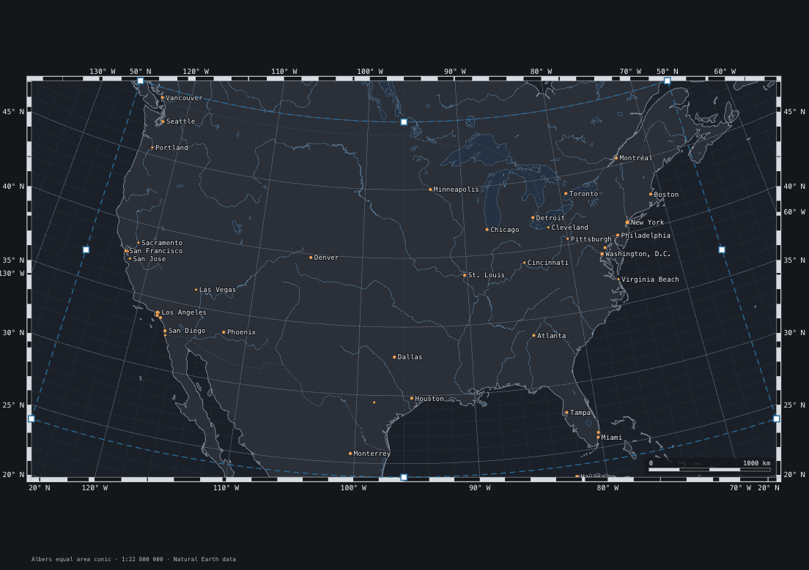
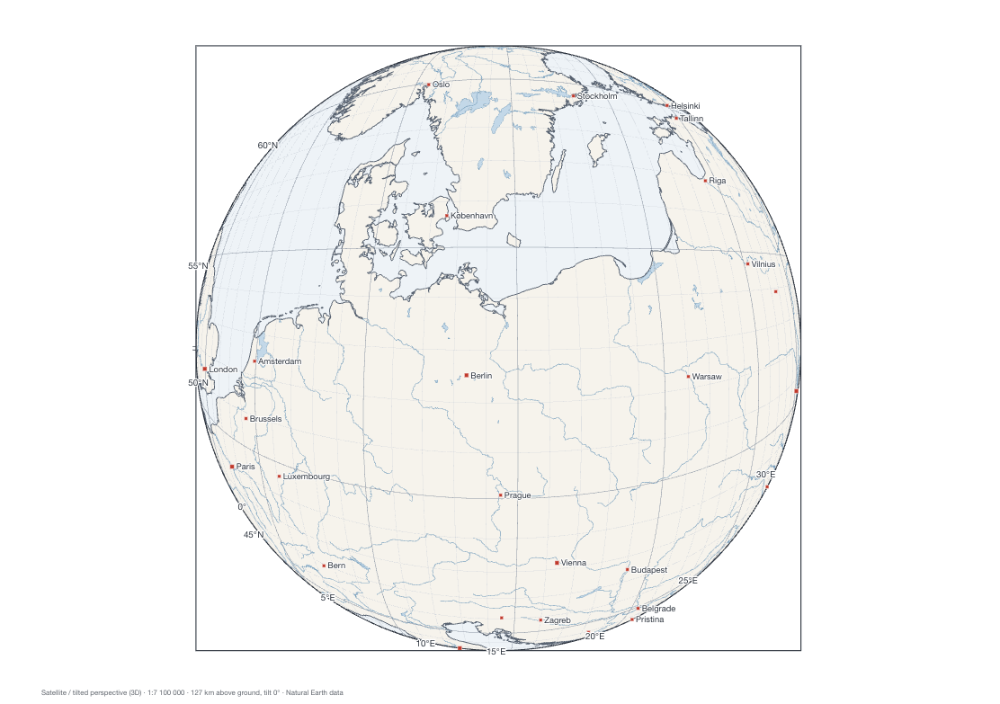
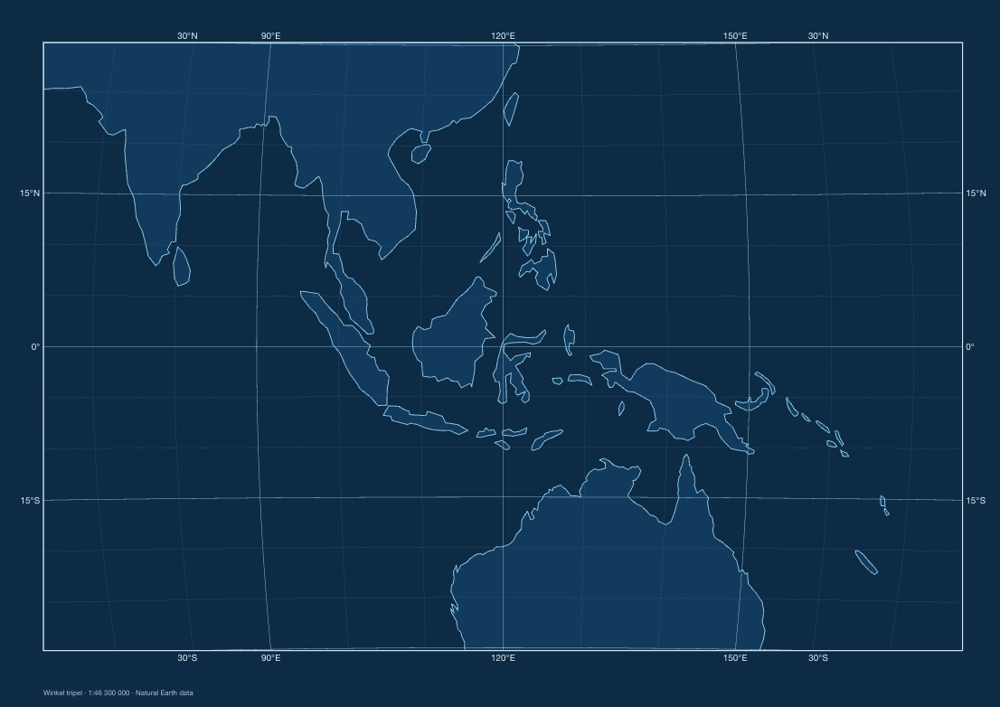
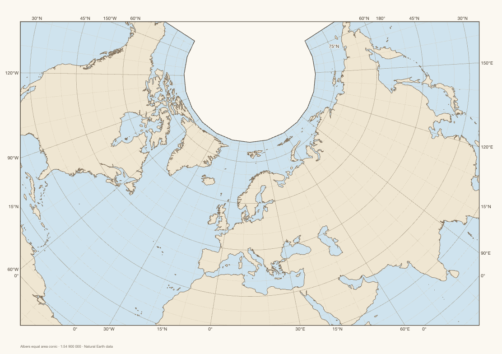
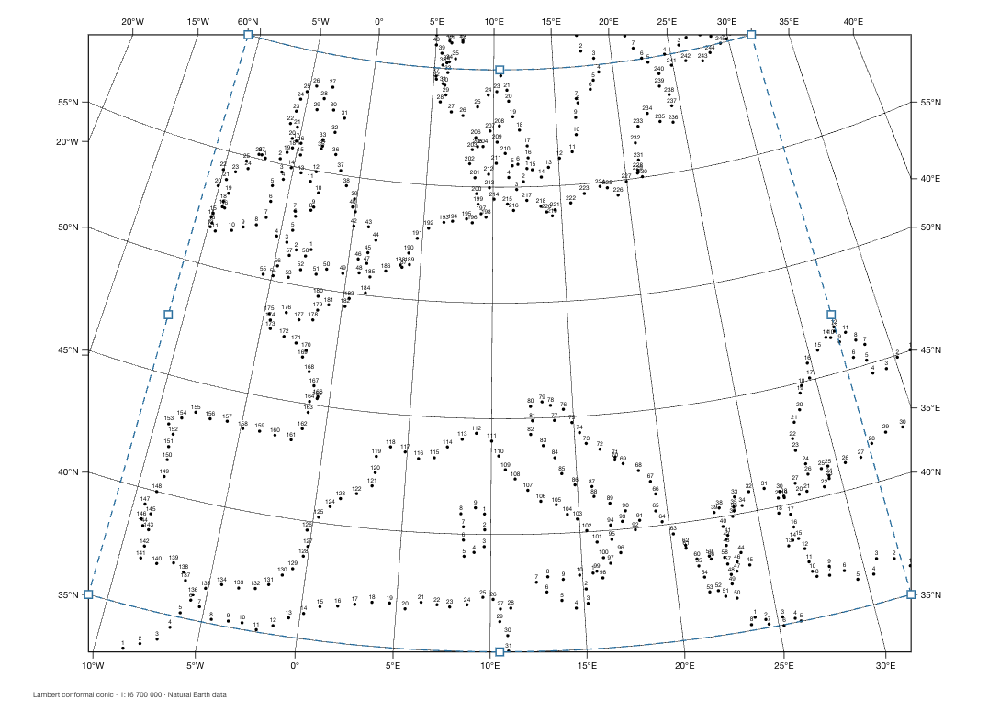
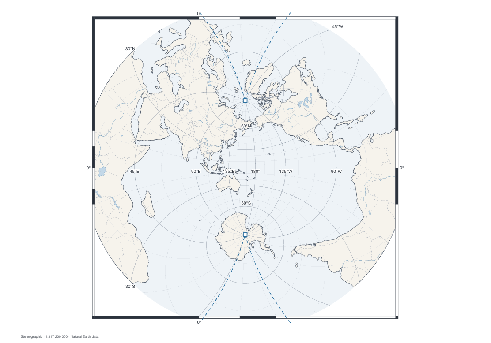
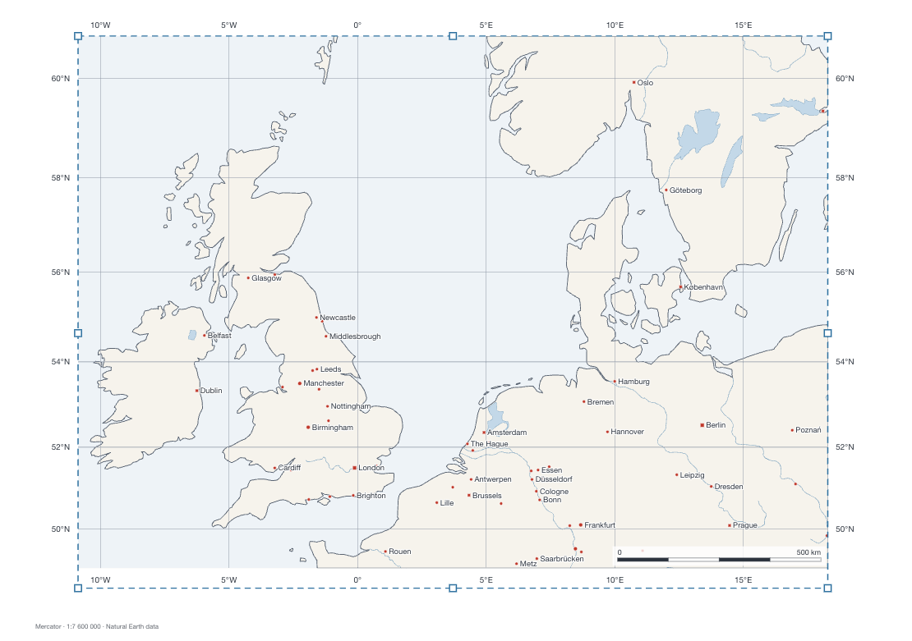

# mapgrid

A static site that generates printable grids of parallels and meridians for any part of the
world — in a choice of common projections, or in a tilted 3D view like an oblique satellite
photograph — and exports them as SVG or PNG.

**[Open the app](https://orestesgaolin.github.io/map-grid/)** ·
[source](https://github.com/orestesgaolin/map-grid) ·
[MIT licence](LICENSE)



<!-- Table with images -->

<table>
<tr>
<td></td>
<td></td>
<td></td>
</tr>
<tr>
<td></td>
<td></td>
<td></td>
</tr>
<tr>
<td></td>
<td></td>
<td></td>
</tr>
</table>


## What it does

**Graticule.** Meridians and parallels at a labelled step plus a finer subdivision step, chosen
automatically from the size of the section or set by hand from 90° down to 12″. Lines are traced
through the projection and clipped, so they curve correctly in every frame.

**Border marks.** Where a graticule line meets the neatline, the tool places a tick and a
coordinate label (`45°30′ N`, `45.5° N` or `+45.5°`), and it can draw the classic chequered
border band, alternating at the subdivision step. The band is decided per edge, because it can
only exist where the graticule actually reaches the frame: a section or a cylindrical world map
gets all four edges, a Robinson oval gets top and bottom where its pole lines touch, and a globe
gets none and falls back to ticks — the panel says so when it does.

A line that never reaches the frame is labelled on the map instead: at the open end of the line,
or along a parallel or meridian inside the view. A line whose frame label merely lost a collision
with its neighbours is dropped, since thinning a crowded edge is normal and moving the label
inside would print a second, jumbled row.

**Frames.**

| Frame | What it fits |
| --- | --- |
| Whole world / hemisphere | the full sphere in the chosen projection |
| Section | a longitude/latitude box, fitted to the page |
| 3D tilted view | a satellite camera at a chosen height and tilt |

**Projections.** 26 of them, from d3-geo and d3-geo-projection: equirectangular, Mercator,
transverse Mercator, Miller, cylindrical equal area, Robinson, Winkel tripel, Natural Earth,
Equal Earth, Mollweide, Hammer, Aitoff, Eckert IV, sinusoidal, Van der Grinten, Lambert
conformal conic, Albers equal area conic, equidistant conic, Bonne, polyconic, orthographic,
stereographic, azimuthal equidistant, azimuthal equal area, gnomonic, and the tilted satellite
perspective.

**3D view.** Height above ground from 30 km to 60 000 km, tilt 0–60°, plus how much of the
horizon to use. A tilted perspective has a vanishing line beyond which the ground projects to
infinity; the field of view is limited automatically to stay in front of it, so a low, strongly
tilted view covers less ground. The panel reports how far the view reaches.

**Layers.** Land silhouette, coastline, sea fill, rivers and lake centre lines, lakes, country
borders, populated places (filtered by population, capitals marked with a square), globe
outline, neatline, scale bar, title block and a footer with the projection, scale and data
credit. Three levels of coastline detail: 110m, 50m and 10m.

**Connect the dots.** A layer that replaces the coastline — and the country borders, when that
layer is on — with evenly spaced dots: a connect-the-dots puzzle of any coast. The spacing slider
is the quality control: closer dots follow the coast more faithfully, wider dots make an easier
puzzle. Each piece can be numbered, and by default each gets its own marker (dot, ring, square,
hollow square, diamond, hollow diamond) so that neighbouring runs can be told apart without
numbers. *Hide the lines the dots follow* suppresses the coast and border strokes, which is what
turns the sheet into a puzzle rather than a traced outline. Small islands can be dropped by
setting how many dot spacings a coast must be worth to qualify. Where the frame cuts a coastline,
the clipped edge along the frame is split out rather than dotted, so no row of dots marches down
the neatline.

**Sea as a difference.** *Sea cut around land* (on by default) appends the coastline rings to the
sea path and fills it with the even-odd rule, so the sea is one real outline with the land as
holes rather than a rectangle hidden behind the land. It stays correct under a transparent land
fill, prints and plots as a single shape, and — with the land layer switched off — leaves the
land as bare paper. The land colour then comes from the sphere painted underneath, so the
coastline geometry is still stored only once.

**Page and style.** A5 to A2, Letter, Tabloid, square or a custom size in millimetres, either
orientation, adjustable margin. Five colour themes (print, line art, atlas, blueprint, night),
every colour editable, three type families, one line-weight control.

**Footer.** An optional line under the map records the projection, the scale, the 3D height and
the Natural Earth credit, with a site label on the right — `config.js` sets the default
(`siteLabel`) and the field in *Page and style* overrides it per map.

**Export.** SVG carries the page size in millimetres, so it prints at the size shown and stays
editable in Illustrator or Inkscape — presentation attributes only, no stylesheet, no external
references. PNG is rasterised at 96, 150, 300 or 600 dpi.

**Interaction.** Drag to rotate the globe or move the section, scroll to zoom (in the 3D view,
scrolling changes the height). In a section, eight handles on the box edges and corners resize it
like a crop tool: the map holds still while a dashed outline follows the pointer — a live refit
would move the ground under the cursor and the gesture would fight itself — and the new box is
applied on release. The handles are interface furniture marked `data-ui`, so export removes them
and printing hides them. The full state lives in the URL, so any map can be shared or bookmarked
with the *Copy link* button.

## Running it locally

Any static file server will do — the data is loaded with `fetch`, so `file://` will not work:

```sh
npm run serve      # python3 -m http.server 8080
open http://localhost:8080
```

## Regenerating the data

Only needed when you want different sources or resolutions:

```sh
npm install        # tooling only, not needed to serve the site
npm run build      # vendor bundles + data payload
```

- `tools/build-vendor.mjs` copies `d3`, `d3-geo-projection` and `topojson-client` into
  `js/vendor/`.
- `tools/build-data.mjs` builds `data/`: land and country borders from
  [world-atlas](https://github.com/topojson/world-atlas), rivers, lakes and populated places
  from [Natural Earth](https://www.naturalearthdata.com/) via
  [natural-earth-geojson](https://github.com/martynafford/natural-earth-geojson). Downloads are
  cached in `.cache/`.

The build rewinds polygon rings whose spherical area covers more than half the globe and then
checks that land measures about 3.6 steradians. Without that, the three inverted rings in the
10m source make d3 fill the sea instead of the land as soon as the map is clipped to a circle.

## Layout

```
index.html            markup and the whole control panel
config.js             repository link, footer site label, analytics switch
css/app.css           interface only; nothing inside the map SVG depends on it
js/analytics.js       optional cookieless analytics, inert until configured
js/state.js           defaults, dotted-path access, URL hash
js/projections.js     projection registry, aiming, fitting, clipping, tilt limits
js/geo.js             graticule construction, tracing, border ticks, label formats
js/render.js          builds the SVG
js/datasets.js        lazy data loading
js/style.js           themes, fonts, line widths
js/ui.js              control binding and conditional visibility
js/exporter.js        SVG and PNG download
js/presets.js         starting points and named regions
data/                 generated Natural Earth payload (10 MB, loaded on demand)
tools/                data and vendor build scripts
```

The renderer is a pure function of state plus data: `render(state, data) -> {svg, info}`. Nothing
is mutated in place, and the SVG that goes on screen is byte-for-byte what gets exported.

## Limits worth knowing

- Natural Earth 10m is drawn from roughly 1:10 000 000 source material. Sections finer than
  about 1:1 000 000 still work, but the coastline turns visibly angular.
- A strongly tilted 3D view at low altitude narrows the field of view; that is the perspective
  geometry, not a clipping bug.
- PNG export is bounded by the browser canvas (16 384 px per side, about 250 megapixels). Use
  SVG for anything larger.
- Fonts are named generically (Helvetica/Arial, Georgia/Times, system monospace) so exported
  files render anywhere; no font is embedded.

## Analytics

Off by default: a plain checkout makes no third-party request. GitHub Pages itself reports
nothing about visitors — the repository's Insights → Traffic panel counts views of the *repository
page* and clones, not hits on the published site — so measuring visits needs a script.

Three cookieless providers are supported. Name one in `config.js` and it is loaded; leave
`provider: 'none'` and `js/analytics.js` does nothing.

| Provider | Cost | Notes |
| --- | --- | --- |
| [GoatCounter](https://www.goatcounter.com) | free for personal use | open source, no cookies, no personal data, ~3 kB. `site: 'yourcode'` for `yourcode.goatcounter.com` |
| [Plausible](https://plausible.io) | paid, or self-hosted | `site` is the domain you registered, `host` an optional self-hosted origin |
| [Umami](https://umami.is) | self-hosted | `site` is the website id, `host` the origin serving `script.js` |

```js
// config.js
analytics: {provider: 'goatcounter', site: 'mapgrid', host: '', respectPrivacySignals: true, allowLocalhost: false},
```

Google Analytics is deliberately not wired in: GA4 writes `_ga` cookies by default, and its
cookieless mode gives up most of what it is for.
[Cloudflare Web Analytics](https://www.cloudflare.com/web-analytics/) is free and cookieless too,
but it has no custom events — if you prefer it, paste its beacon `<script>` into `index.html` and
leave `provider: 'none'`.

What gets sent, beyond the automatic page view: `export/svg`, `export/png` and `preset`, each with
the projection, frame type and resolution as properties. Never any map content, coordinates or
identifier. Requests are skipped for visitors sending Do Not Track or Global Privacy Control, and
on localhost.

## Licence

[MIT](LICENSE) © Dominik Roszkowski.

Natural Earth data is in the public domain. d3 and TopoJSON are ISC/BSD licensed; their notices
are inside the bundles in `js/vendor/`.
